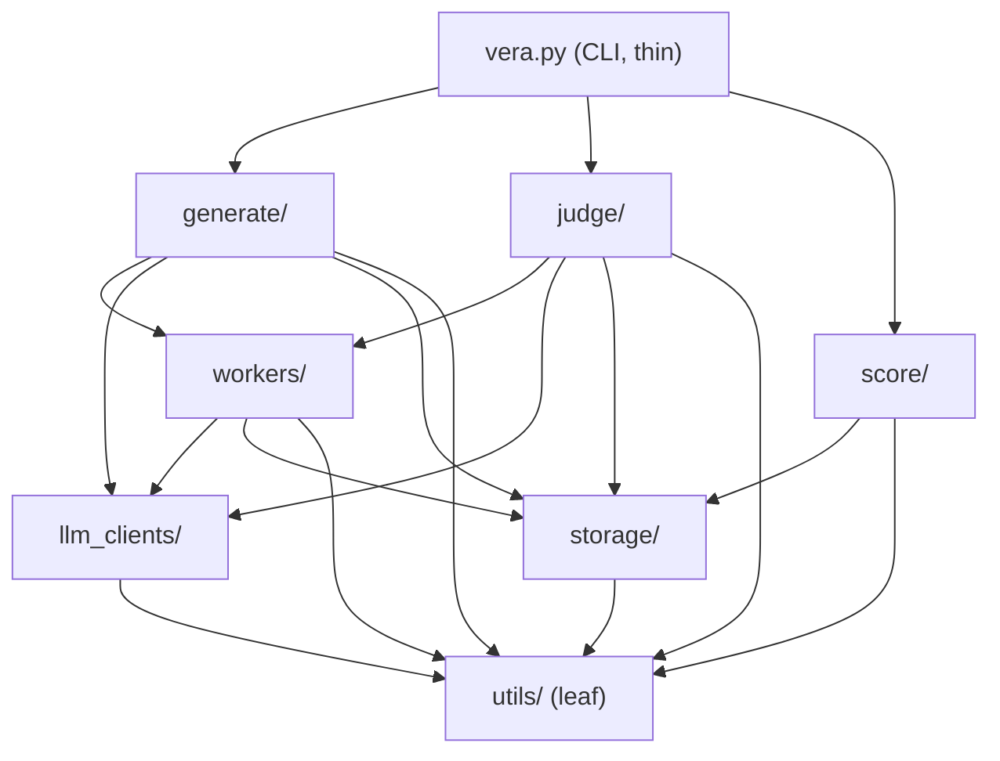

# Architecture Spine — VERA-MH Target Architecture

## Design Paradigm

**Layered architecture, strict top-down dependency direction, with per-concern adapter-pattern interface colocation.**

This is not hexagonal/ports-and-adapters in the strict sense: domain packages import concrete infrastructure packages directly (`generate/` and `judge/` call into `llm_clients/` and `storage/` themselves), rather than depending only on domain-owned ports that outer adapters implement via injection. What it borrows from hexagonal is narrower and more useful here: each infrastructure concern owns its own interface next to its own implementations (`llm_clients/` holds `LLMInterface` plus every provider, `workers/` holds `QueueProtocol` plus `LocalQueue`/`SQSQueue`, `storage/` holds `StorageBackend` plus `LocalFilesystemStorage`/`S3Storage`), instead of a single cross-cutting `interfaces/` package grouping every ABC by "abstract vs. concrete." That colocation is chosen explicitly (memlog) to satisfy the Common Closure Principle: an LLM-provider change and a storage-backend change have nothing to do with each other and should not force a shared package to move.

Layer → package mapping:

| Layer | Packages |
| --- | --- |
| CLI orchestrator | `vera.py` |
| Domain (mutually isolated) | `generate/`, `judge/`, `score/` |
| Workers | `workers/` |
| Infrastructure | `llm_clients/`, `storage/` |
| Shared utilities (leaf) | `utils/` |

## Invariants & Rules



No edge runs `generate/` ↔ `judge/` ↔ `score/`, and none runs from `workers/`, `llm_clients/`, or `storage/` back up into any domain package — `workers/` receives handler instances from domain at startup (inversion of control), it never imports domain code to find them.

### AD-1 — Single, thin CLI entrypoint

- **Binds:** `vera.py`, `generate/`, `judge/`, `score/`
- **Prevents:** business logic creeping into the CLI entrypoint; a fat orchestrator re-implementing what domain runners already do; a second root-level entrypoint script reappearing after migration.
- **Rule:** [ADOPTED] `vera.py` is the only root-level orchestrator; domain packages are libraries, not invoked directly as scripts, and no root-level Python entry-point scripts exist alongside it. `vera.py` only parses arguments and delegates — pipeline step sequencing delegates to domain runners/handlers, never to inline logic in `vera.py` itself.

### AD-2 — Domain package isolation and workers inversion of control

- **Binds:** `generate/`, `judge/`, `score/`, `workers/`
- **Prevents:** hidden coupling between domain packages; `workers/` becoming a place domain logic leaks into, or a place that has to know about domain packages to dispatch to them.
- **Rule:** [ADOPTED] `generate/`, `judge/`, and `score/` never import each other. `workers/` never imports any domain package — domain registers handler instances into `workers/` at startup; control never flows the other way.

### AD-3 — Generation core purity

- **Binds:** `generate/`
- **Prevents:** I/O leaking into the simulation core; two callers disagreeing about who is responsible for writing transcripts.
- **Rule:** [ADOPTED] The conversation simulator is pure — persona + LLMs in, message list out, no filesystem access. The handler owns all I/O. The simulator's queue is a pluggable `QueueProtocol`, with an in-memory local queue as the default.

### AD-4 — judge/ vs score/ ownership split

- **Binds:** `judge/`, `score/`
- **Prevents:** scoring logic re-coupling into `judge/`; hidden auto-scoring side effects from a judge run.
- **Rule:** [ADOPTED] `judge/` is evaluation only (pure navigator + LLM-judge core; handler owns I/O). `score/` is a separate top-level package owning aggregation, visualization, and pooling (`score.py`, `score_viz.py`, `pool.py`). Judge never auto-scores — `vera score` and `vera pool` are separate subcommands a caller must invoke explicitly.

### AD-5 — Generate→judge handoff is file-first

- **Binds:** `generate/`, `judge/`
- **Prevents:** generation and judging becoming implicitly coupled in-process; judging depending on generation's runtime state rather than its durable output.
- **Rule:** [ADOPTED] Transcripts on disk are the source of truth between generation and judging. They run as independent processes; judging is decoupled from generation and can be pointed at any existing conversation folder(s), with no enforced coupling to originating personas.

### AD-6 — Cross-run/cross-folder aggregation belongs to score/ only

- **Binds:** `judge/`, `score/`
- **Prevents:** judge quietly growing its own aggregation logic; two different aggregation mechanisms (one in judge, one in score) drifting apart.
- **Rule:** [ADOPTED] Judging a run against N conversation folders keeps results independent per folder — judge never combines them. Aggregation across runs or folders (multi-folder comparison, pooling) is exclusively `score/`'s responsibility.

### AD-7 — llm_clients/ plugin registry

- **Binds:** `llm_clients/`
- **Prevents:** the provider factory needing an edit for every new provider; config-shape disagreements between providers.
- **Rule:** [ADOPTED] Providers self-register via a decorator; the factory resolves by prefix. Each provider owns its own `@dataclass` config with a `from_env()` constructor — no shared/global provider-config shape is imposed from outside.

### AD-8 — workers/ is a separate top-level package with explicit dispatch

- **Binds:** `workers/`, `vera.py`
- **Prevents:** hidden registration magic; `workers/` depending on domain packages (which would invert AD-2).
- **Rule:** [ADOPTED] `workers/` sits between domain and infrastructure as its own top-level package (not folded into `utils/`). `vera.py` wires concrete handler instances into a `WorkerPool` at startup — no implicit/magic handler registry. `QueueProtocol` (ABC) exists from day one; `LocalQueue` (asyncio) is the only implementation now, `SQSQueue` is a drop-in later behind the same protocol.

### AD-9 — Interfaces are colocated with implementations, per concern

- **Binds:** `llm_clients/`, `workers/`, `storage/`
- **Prevents:** a cross-cutting `interfaces/` package that groups ABCs by "abstract vs. concrete" instead of by concern, creating indirection with no cohesion benefit; a provider shipping a synchronous call method that silently serializes the queue's intended concurrent fan-out.
- **Rule:** [ADOPTED] Each infrastructure package owns its interface next to its own implementations: `llm_clients/` holds `LLMInterface` + providers, `workers/` holds `QueueProtocol` + queue implementations, `storage/` holds `StorageBackend` + storage implementations. A single global `interfaces/` package holding every ABC was explicitly considered and rejected. `LLMInterface`'s core call method is `async def` — `workers/`'s only implementation (`LocalQueue`, AD-8) is asyncio-based, and a synchronous provider implementation would block the event loop other providers' calls run on, silently serializing what `-u gpt:5 sonnet:5`-style fan-out is supposed to run concurrently.

### AD-10 — Storage backend is a raw bytes/keys abstraction only

- **Binds:** `storage/`
- **Prevents:** `storage/` re-absorbing run-semantics knowledge that belongs in `utils/naming.py`, which would duplicate path-building logic in two places; a collision or existence check bypassing the abstraction via a raw `os`/`pathlib` call, which would silently stop enforcing that check the moment a non-local `StorageBackend` implementation (e.g. `S3Storage`) ships.
- **Rule:** [ADOPTED] `StorageBackend` exposes `write(key, bytes)` / `read(key)` / `exists(key)` only. It knows nothing about `conversations/`, `config.json`, or `evaluations/` structure — `utils/naming.py` builds keys/paths, `storage/` only persists whatever bytes and key it is given. Any code checking whether a run-output key already exists — including AD-24's run-folder collision check — MUST call `StorageBackend.exists()`; raw filesystem calls against run-output paths are never used outside `storage/`'s own implementations.

### AD-11 — utils/ is a true leaf

- **Binds:** `utils/`
- **Prevents:** `utils/` becoming a dumping ground for anything reused twice, including logic that is actually domain logic.
- **Rule:** [ADOPTED] `utils/` contains only leaf, pure helpers (types, naming, layout, paths, stateless cross-package helpers). Domain logic never lands here even when it is reused across packages. `utils/` does not import `generate/`, `judge/`, `score/`, `workers/`, `llm_clients/`, or `storage/`.

### AD-12 — Naming/layout logic lives in exactly one module

- **Binds:** `utils/naming.py`, `generate/`, `judge/`, `score/`
- **Prevents:** the `c_`/`u_`/`j_` naming scheme (already revised multiple times during design) being reimplemented — and re-diverging — inside every handler that builds a path.
- **Rule:** [ADOPTED] All folder/file naming and layout logic — the `c_`/`u_`/`j_` scheme, timestamp/sha composition, persistent-vs-flat nesting — lives in one `utils/` module (`utils/naming.py`, with `utils/conversation_layout.py` building on it, never the reverse). No domain package or handler duplicates or reimplements this logic.

### AD-13 — Logging is a wrapper/context concern, never inline in cores

- **Binds:** `generate/`, `judge/`, `llm_clients/`, `utils/`
- **Prevents:** log statements polluting pure simulator/navigator/evaluator cores, which would break AD-3's purity guarantee.
- **Rule:** [ADOPTED] Handler-level job start/end logs go through `JobContext`. API call/response logs go through a `LoggingLLM` wrapper living in `llm_clients/`. Simulator, navigator, and evaluator cores contain zero log statements. `llm_factory.py` applies the `LoggingLLM` wrapper to every provider instance it constructs and returns — logging coverage is universal by construction, never an individual provider author's own responsibility to opt into. `JobContext` is logging-only: it never writes `state.json` or any other run-output artifact (see AD-18).

### AD-14 — Role has exactly one definition

- **Binds:** `utils/role.py`, all packages
- **Prevents:** a second, drifting copy of the `Role` enum appearing in `llm_clients/` or elsewhere.
- **Rule:** [ADOPTED] `Role` is defined once, in `utils/role.py`. No package defines its own copy.

### AD-15 — Stable interfaces require a design doc before modification

- **Binds:** `llm_clients/llm_interface.py`, `workers/queue.py`, `storage/storage_backend.py`, `utils/role.py`, `utils/naming.py`, `utils/conversation_layout.py`, `utils/config_schema.py`
- **Prevents:** a routine PR silently changing a contract every other package depends on; a load-bearing layout file being left off the protected list even though a paired AD (AD-12) already treats it as inseparable from a file that is protected.
- **Rule:** [ADOPTED] This fixed set of stable interfaces is called out individually in `.github/CODEOWNERS` (not just covered by whole-package rules). Today, three of these files exist and are already listed there: `llm_clients/llm_interface.py`, `utils/role.py`, `utils/naming.py`. `utils/conversation_layout.py` also exists in the tree today — per AD-12 it builds directly on `utils/naming.py` and is inseparable from it in practice — and is added to `.github/CODEOWNERS`' stable-interfaces block alongside `utils/naming.py` as of this AD. The remaining three files don't exist yet and are added to that block once each is created, per `.github/CODEOWNERS`' own comment: `workers/queue.py` (Phase 5), `utils/config_schema.py` (Phase 3), `storage/storage_backend.py` (Phase S). This is a target-state list, not a claim that all six files are already CODEOWNERS-listed today. Any change to a listed (or pending, once created) stable interface is an ESCALATE case: a short design doc (what's changing, why, what it breaks) is required before opening the PR — a PR alone is not sufficient.

### AD-16 — Import-graph enforcement is static, fast, and CI-gated

- **Binds:** all packages
- **Prevents:** the import-graph rules in AD-2, AD-9, AD-11, and AD-14 drifting silently until a human happens to notice.
- **Rule:** [ADOPTED] import-linter (declarative layer contracts in `pyproject.toml`) plus grimp-based pytest assertions (custom import-graph checks) both run in CI. They encode: `generate/` ⊥ `judge/` ⊥ `score/`; `workers/` does not import domain packages; `llm_clients/` does not import domain or `workers/`; `storage/` does not import domain or `workers/`; `utils/` is a true leaf; `Role` lives only in `utils/role.py`.

### AD-17 — --config and CLI flags are mutually exclusive

- **Binds:** `vera.py`, `utils/config_schema.py`
- **Prevents:** a merge/override mechanism between two config sources that would make the effective config ambiguous or order-dependent.
- **Rule:** [ADOPTED] For a given run, a piece of information (model selection/repeats, sampling knobs, persona/rubric lists, etc.) is supplied via `--config` JSON or via CLI flags, never both. Supplying the same information through both is rejected/errors — there is no silent merge. `--config` always resolves internally to the same canonical flag-set the CLI would have produced, and that resolved form is printed at run start.

### AD-18 — config.json and state.json are two distinct artifacts

- **Binds:** `utils/config_schema.py`, all subcommands that write run output
- **Prevents:** one evolving "manifest" file trying to be both the immutable record of what was requested and the mutable record of what happened — which is exactly the resume-correctness bug this split avoids; two independent code paths racing to mutate `state.json` with no defined lock or merge order; the same logical config hashing differently across two implementations and silently defeating the idempotency signal the hash exists to provide.
- **Rule:** [ADOPTED] Every run writes `config.json` (immutable copy of the resolved config, written once at run start, never modified afterward) plus a `config.json.sha256` sidecar (hash lives outside the file it hashes, avoiding self-referential canonicalization). `config.json.sha256` is computed over a canonical serialization of `config.json`'s content — sorted keys, fixed separators, no incidental whitespace — and that content excludes any wall-clock/generation timestamp field, so identical semantic configs (same models, rubrics, personas, knobs) hash identically regardless of when or how many times they are produced. **This is computed exactly once, by exactly one function, and that single value is what both the run-id folder name's `<sha>` component (Consistency Conventions, Naming) and the `config.json.sha256` sidecar's content contain — never two independent computations that could drift apart.** The filename `config.json` itself never carries the hash (rejected: would put the same value in a third place with no added integrity benefit, since a corrupted file wouldn't automatically stop matching its own filename — verification still requires hashing the actual bytes, which is what the sidecar is for). `state.json` is a separate, mutable file tracking run progress (completed items, errors, output paths so far) — it is the only file `vera resume` writes to. `state.json` records both the requested and the actual-resolved model identifier. `state.json` has exactly one writer per run: the domain-package runner (`generate/runner.py` / `judge/runner.py`) that owns I/O per AD-3/AD-4. `workers/`'s `JobContext` observes job start/end for logging (AD-13) but never writes `state.json` itself.

### AD-19 — generation and judging config blocks are orthogonal

- **Binds:** `utils/config_schema.py`
- **Prevents:** model selection for generation implicitly influencing, or being influenced by, model selection for judging.
- **Rule:** [ADOPTED] `config.json`'s `generation` and `judging` top-level blocks are completely independent. There is no shared `models` field; `generation.models` and `judging.models` (with per-rubric overrides in `judging.rubrics[].models`) are set and read independently.

### AD-20 — judging.rubrics is a list from day one

- **Binds:** `utils/config_schema.py`, `judge/`
- **Rule:** [ADOPTED] `judging.rubrics` (and its CLI precursor, `--rubrics`) is list-shaped starting at the very first phase that implements it, even while only a length-1 list is supported/validated until multi-rubric support ships. This closes a real schema-break risk: locking a scalar shape early would force a breaking config change later.
- **Prevents:** a later multi-rubric phase requiring a breaking schema change for every config already written against a scalar `rubric` field.

### AD-21 — Rubric bundle manifest vs config.json separation of concerns

- **Binds:** rubric bundle manifest files, `utils/config_schema.py`, `judge/`
- **Prevents:** judge-model defaults or other per-run execution knobs leaking into the manifest, which would make the same rubric bundle behave differently across runs without a visible reason.
- **Rule:** [ADOPTED] A rubric bundle manifest describes what a rubric **is** (`rubric_file`, `rubric_prompt_beginning_file`, `question_prompt_file`, an informational `personas` list) — static content that changes rarely. `config.json`'s `judging.rubrics[].models` describes how to **run** it for a given invocation — judge models, repeats, per-rubric overrides — and changes every run. Judge-model defaults never belong in the manifest. When a config omits judge-model selection entirely, the fallback default MUST be defined in exactly one place — `utils/config_schema.py`, the protected stable interface for config shape (AD-15) — never in the manifest, and never re-defined inside `judge/rubric_config.py` (AD-22) or any other loader, which may only read the default, not define its own copy. This is a MUST, not descriptive prose: a default landing anywhere ungoverned would produce exactly the run-changing-behavior-with-no-visible-reason effect this AD exists to prevent, without escalating through AD-15's design-doc gate. **The manifest's `personas` field stays informational-only for every invocation shape except one:** `vera pipeline --target <name>` is an additive, opt-in shorthand that resolves `<name>` to one rubric bundle manifest and expands to setting BOTH `generation.personas` and `judging.rubrics` from it in a single shot — the manifest's `personas` field becomes the actual, authoritative generation input only for this shorthand. Any other invocation shape (`--rubric` plus independently-specified generation personas, or `--config` with both blocks set explicitly) keeps `generation`/`judging` fully orthogonal exactly as AD-19 requires — `--target` is the one deliberate, named exception, not a general weakening of AD-19.

### AD-22 — Reusable rubric-loading logic lives in a library helper, not a doomed script

- **Binds:** `judge/`
- **Prevents:** logic that later CLI phases need being thrown away with the CLI script it was first written inside.
- **Rule:** [ADOPTED] The rubric-bundle-manifest loading logic is implemented as a library-layer helper (e.g. `judge/rubric_config.py`), not inline in a CLI script's `main()` that is slated for deletion. Later phases call the same helper rather than reimplementing rubric loading.

### AD-23 — Output layout is nested-only, with path-first stage contracts

- **Binds:** `generate/`, `judge/`, `score/`, `utils/naming.py`
- **Prevents:** stage code depending on a flat-layout path shape that no longer exists; resume logic re-deriving state from scratch instead of reading it.
- **Rule:** [ADOPTED] The flat output layout is removed; only the nested layout (`output/c_<chatbot>/<run>/conversations/`, `.../evaluations/<rubric>/j_<run>/...`) is valid. Stage handoffs are path-first contracts, recording models/personas/artifact paths/timestamps, usable as input for resume or a new run.

### AD-24 — Existing run-output collisions error out

- **Binds:** `generate/`, `judge/`, all subcommands that create a run folder
- **Prevents:** silent overwrite of a prior run's artifacts, or an auto-suffix scheme that hides the collision from the caller; a per-file re-check that wrongly fails a run's own legitimate second write into an already-validated run folder; a resume path that either bypasses this check by accident or gets routed through the generic run-creation path and trips it, making `vera resume` permanently non-functional.
- **Rule:** [ADOPTED] The collision check runs exactly once per run, against the run-root key, at run-folder creation time in the domain-package runner (`generate/runner.py` / `judge/runner.py`) — never per-file on every subsequent write within that run. If the run-root already exists at that single check, the run errors out; no overwrite, no auto-suffix. Individual file writes within an already-validated run root never re-check existence. The check goes through `StorageBackend.exists()` (AD-10) — never a raw filesystem call — so the rule keeps working unchanged once a non-local `StorageBackend` (e.g. `S3Storage`) ships. `vera resume` is explicitly exempt from this check: resume operates by design on an existing run folder, validates via `config.json` + its `.sha256` sidecar (AD-18) instead, and never invokes the run-creation collision check.

### AD-25 — Rubric/persona content lives outside code proper, never requiring a code change

- **Binds:** `data/`, the rubric bundle manifest (AD-21), persona files, all packages that consume them
- **Prevents:** an engineer embedding rubric dimensions, question flows, or persona definitions directly in Python (e.g. as constants, dataclass defaults, or inline dicts) rather than as data files — which would silently reintroduce a code-change requirement for a non-developer-facing workflow, and would fragment "where does rubric/persona content live" across code and data depending on who built which part.
- **Rule:** [ADOPTED] Rubric and persona content (dimensions, question flows, prompt text, persona definitions) MUST live in `data/` (or another location outside any Python package), never embedded in code, because VERA-MH must be usable by non-developers who add or edit rubrics and personas without touching Python. `data/` is a supporting path outside the import graph specifically for this reason — no domain package may hardcode rubric/persona content as an alternative to reading it from `data/`.

### AD-26 — Rubric navigation logic lives in code, never in the prompt

- **Binds:** `judge/`, rubric bundle manifests (AD-21), `data/` (AD-25)
- **Prevents:** an engineer embedding flow-control hints ("if the answer is X, the next relevant topic is Y") inside prompt text and asking the LLM to decide what happens next — non-deterministic, untestable, and a divergence risk between two engineers who might otherwise put navigation logic in different places (one in code, one in a prompt) for the same rubric.
- **Rule:** [ADOPTED] Which question is asked next given an answer (the rubric's `GOTO`/`END`/`ASSIGN_END`/conditional-jump directives, per `judge.md`) is determined entirely by code — the rubric's question-flow data (parsed from its TSV into `question_flow_data`) navigated deterministically by `QuestionNavigator`. The judge LLM's role is strictly to answer/judge the current question; it is never asked to decide or influence which question comes next. Rubric content in `data/` (AD-25) may describe *what* the flow is (the TSV's navigation column), but the *logic that walks it* is code, not something inferred from prompt text.

## Consistency Conventions

| Concern | Convention |
| --- | --- |
| Naming (entities, files, folders) | Three-entity vocabulary `u`/`c`/`j` (user/persona LLM, chatbot under test, judge) applies at both folder and file level. Run-id = `<model>_<timestamp>_<sha256-of-config.json>`. Conversation filename = `u_<persona-file>_<persona-name>_c_<chatbot-model>.json`. Generation groups persistently per chatbot (`c_<model>/` accumulates every run against that model); judging stays flat per run (`j_<model>_<timestamp>_<sha>/`, no persistent per-judge-model parent) — an intentional asymmetry, not an inconsistency. Standalone judging (no parent pipeline run to nest under) uses `config.json`'s sha256 as its own top-level identity, sibling to the `c_*` directories — a free idempotency signal, since identical configs re-run produce the same folder name. |
| Data & formats (config shape, hashing, model identifiers) | `config.json` is JSON only, never YAML (robust for stdin/env-var transport with no escaping ambiguity). `generation.models` and `judging.models` are each a **list** of `{name, repeats, <knobs>}` objects, not an object keyed by model name — so the same model can appear twice with different knobs in one run. `models[].name` is always a specific model identifier in the provider's own naming (e.g. `claude-sonnet-2026xxxx`), never a bare provider name. Bespoke sampling knobs (temperature, top_p, max_tokens) are config-only, never expressible via `-u`/`-j` shorthand. Provider connection details (endpoint, API version, region) stay env-sourced only. `config.json.sha256` lives as a sidecar file, never as a field inside `config.json` itself. |
| State & cross-cutting (config/CLI exclusivity, logging, resume) | `--config` and CLI flags are strictly either/or (AD-17); the resolved form is printed at run start (stdout only) for traceability, with an opt-in `--print` flag to emit it without executing. `vera resume` is the only path that writes to `state.json`, and it first verifies `config.json` against its `.sha256` sidecar before reading either file. Logging is wrapper/context-owned only (AD-13) — never inline in a pure core. Folder-already-exists on run start errors out, no overwrite (AD-24). |

## Stack

| Name | Version |
| --- | --- |
| Python | `>=3.11` (per `pyproject.toml` `requires-python`; ruff `target-version = "py311"`) |
| Package/dependency manager | uv (`uv.lock` present; CLI usage documented as `uv run python vera.py ...`) |
| langchain / langchain-anthropic / langchain-openai / langchain-ollama | `>=0.1.0` direct floor per `pyproject.toml`, but effectively constrained to the post-1.0 langchain rewrite by `[tool.uv] constraint-dependencies`' `langchain-core>=1.2.5` pin — pre-1.0 langchain is not actually installable under this lockfile despite the loose direct floor |
| langchain-google-genai / langchain-azure-ai | `>=1.0.0` |
| python-dotenv | `>=1.2.2` |
| pydantic | `>=2.12.5` |
| pandas | `>=2.0.0` |
| matplotlib | `>=3.10.8` |
| aiofiles | `>=25.1.0` |
| pytest | `>=7.0.0` in main `[project.dependencies]`, but `>=8.0.0` in the `dev` dependency-group / optional-dependencies — the floor that actually governs local/CI dev installs. `pyproject.toml` itself carries two different floors for the same package; this spine does not silently reconcile them and flags it here as a cleanup item for that file, not a spine error |
| pytest-cov / pytest-asyncio / pytest-mock / pytest-timeout | `>=4.1.0` / `>=0.21.0` / `>=3.12.0` / `>=2.2.0` (dev group) |
| freezegun | `>=1.4.0` (dev group) |
| pre-commit | `>=3.0.0` (dev group) |
| pyright | `>=1.1.0`, mode `basic` currently; target: blocking (no `continue-on-error`) as of migration Phase 5 |
| ruff | `>=0.3.0`, line-length 88, rules `E`/`F`/`I` |
| import-linter, grimp | Not yet present in `pyproject.toml` — planned additions (AD-16), introduced incrementally starting the phase each new boundary is created |

## Structural Seed

Output layout (AD-23, naming per Consistency Conventions):

```text
output/
  c_<chatbot>/                                    # persistent per-chatbot directory
    <timestamp>_<sha>/
      conversations/
        u_<persona-file>_<persona-name>_c_<chatbot>.json
      evaluations/
        <rubric_name>/
          j_<judge>_<timestamp>_<sha>/             # judge stays flat, no persistent parent
            config.json
            config.json.sha256
            state.json
            results.csv
            scores/                                # created by `vera score`
  evaluations/
    <config-sha256>/
      <rubric_name>/                                # standalone judging (vera judge run on its own)
```

Package tree:

```text
vera.py                          # CLI orchestrator, thin
generate/
  conversation_simulator.py      # pure core
  runner.py                      # owns I/O, delegates to workers/
judge/
  question_navigator.py          # pure core
  llm_judge.py                   # pure core
  runner.py                      # owns I/O, delegates to workers/
  rubric_config.py               # reusable rubric-bundle-manifest loader (AD-22)
score/
  score.py
  score_viz.py
  pool.py
workers/
  queue.py                       # QueueProtocol ABC + LocalQueue/SQSQueue
  job_context.py                 # JobContext (handler-level logging)
llm_clients/
  llm_interface.py               # LLMInterface ABC
  llm_factory.py                 # plugin registry, resolves by prefix
storage/
  storage_backend.py             # StorageBackend ABC
  local_filesystem_storage.py
utils/
  role.py                        # single Role definition
  naming.py                      # naming/layout logic, single source of truth
  conversation_layout.py         # builds on naming.py
  config_schema.py               # config.json schema (stable interface)
```

Supporting paths (outside the import graph, but part of the fixed layout):

```text
data/            # committed evaluation inputs — personas, rubrics, prompts
output/          # runtime artifacts (gitignored) — see output layout above
tests/           # permanent tests
```

## Deferred

- **Persona → system-prompt linkage mechanism.** Different personas may need their own system prompt rather than one global prompt shared across all personas. Whether that is a `system_prompt` field on the persona object, a `system_prompt_file` pointer, or something else is undecided. Can wait until the persona schema itself gets formalized (likely alongside the traceability/naming or substantial-refactor work).
- **Operational/deployment envelope.** Future service or scheduled deployment is possible but not committed, and this architecture is explicitly not designed around it yet. Can wait because it would affect the `workers/` queue backend choice (e.g. pulling `SQSQueue` forward) and would need its own operations doc — premature before a concrete deployment requirement exists.
- **Multi-chatbot (multi-provider) support within a single `vera pipeline` invocation.** Stays single-chatbot-per-invocation for now, with cross-chatbot comparison done by looping the CLI externally. Flagged as a possible future addition, not ruled out permanently. Can wait because the external-loop pattern already satisfies every known use case, including batch generate's cross-provider handling.
- **Per-provider concurrency limits.** The shared `workers/` pool enables real parallel fan-out (e.g. `-u gpt:5 sonnet:5`) with no cap on per-provider concurrency yet — only per-call retry/backoff exists today. Flagged as a real requirement for the phase that lands `workers/` unification, not yet designed. Can wait until that phase, since no code path exercises pool-level fan-out at meaningful scale before then.
- **Fate of `scripts/pool_vera_scores.py`.** Whether to fold its logic into `score/pool.py` or delete it outright once `vera pool` fully supersedes it is unresolved. Can wait until the substantial-refactor phase, when `score/` is the only pooling entry point and the script's remaining usage (if any) becomes clear.
- **Fate of `judge/`'s legacy score-tooling siblings.** `score_comparison.py`, `score_comparison_from_export_summary.py`, and `score_utils.py` currently live in `judge/` alongside `score.py`/`score_viz.py`/`pool.py`, and none appear in AD-4's target `score/` package tree. Whether each folds into `score/` during the Phase-2 extraction, gets deleted outright, or stays put is undecided beyond the already-deferred fate of `scripts/pool_vera_scores.py` above. Can wait because Phase-2 execution will need to decide file-by-file once the `score/` extraction is actually underway — this is not a decision this spine can make in the abstract.
